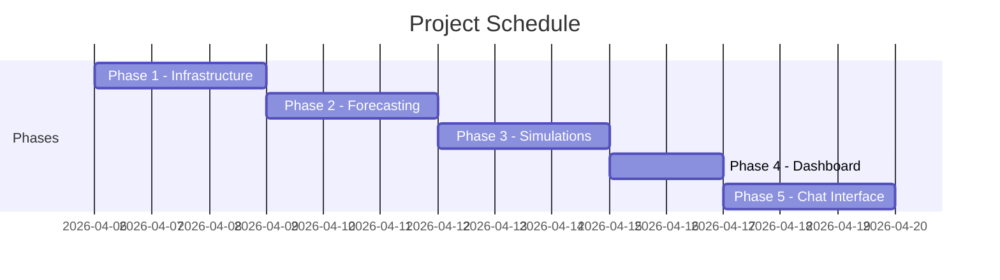
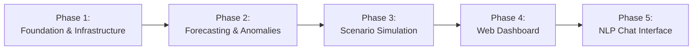

# Customs Analytics Platform – Detailed Project Plan

**Executive Summary:** This project will transform the existing demo into a fully functional, intelligent analytics platform for customs revenue and trade predictions. We adopt a phased, agile approach in line with established project-management best practices【3†L1646-L1654】. The project is split into **five phases** (the last optional) covering infrastructure setup, predictive modeling, scenario simulations, dashboard development, and an NLP chat interface. Each phase has clear objectives, deliverables, and success criteria. The timeline is brief (2–3 days per phase), enabling rapid delivery of value. Key assumptions include a small cross-functional team (project manager, lead researcher, 2 developers, designer, QA) and adequate hardware/cloud resources; budget is unspecified but assumed sufficient for tooling. Stakeholders will define acceptance criteria early, as recommended (planning before execution)【16†L318-L324】. We provide detailed tasks, roles, methods, dependencies, a Gantt chart, RACI matrix, risk register, and recommended templates/tools (mostly from Atlassian and industry best practices) to ensure clarity and accountability throughout the project【3†L1646-L1654】【20†L296-L304】.

## Phase 1 – Foundation & Infrastructure

- **Objective:** Establish a working development environment and project structure. Set up version control, basic code frameworks, containerization, and database connectivity so that the platform can run end-to-end.  
- **Deliverables:** Project repository with `requirements.txt`, initial Dockerfile, working database schema/views, and a stub API that connects to the database and returns test data. Documentation of the development setup.  
- **Tasks:**  
  - Create a new project directory (e.g. `customs-analytics-v2`) and initialize version control (Git).  
  - Define Python dependencies in `requirements.txt` and set up a virtual environment.  
  - Design the initial database schema and create views/tables (e.g. in PostgreSQL).  
  - Develop a basic API endpoint in `main.py` or `fastapi_app.py` that connects to the database (using a new `database.py`) and returns a sample query result.  
  - Write a `Dockerfile` and Docker Compose or equivalent to containerize the API and database. Verify the container builds and runs successfully.  
  - (Optional) Configure a CI/CD pipeline (e.g. GitHub Actions or Jenkins) to build/test the container on each commit.  
- **Methods:** Follow DevOps and infrastructure-as-code practices. Use reference architectures for containerization. Apply agile iteration for incremental builds【3†L1646-L1654】.  
- **Responsible Roles:** Project Manager (A) oversees completion; **Developer** (R) sets up the code structure, containers and database; **Lead Researcher** (C) advises on data access needs; **QA** (I) is informed of setup. Designer is not involved.  
- **Success Criteria:** A development container spins up on any machine, with the API returning expected test data from the database. All listed deliverables (repo, container, basic API) are in place.  
- **Risks & Mitigations:**  
  - *R1: Environment/config issues* – Container or dependency mismatches delay setup. *Mitigation:* Pin library versions, use official Docker images, test early.  
  - *R2: Data availability* – Lack of initial data. *Mitigation:* Use dummy or small real dataset and clearly document data sources for Phase 2.  
  - *R3: Scope creep* – Team tries to add features early. *Mitigation:* Keep focus on minimal viable setup; defer extras to later phases.  
- **Dependencies:** None (Phase 1 is the first step).   
- **Estimated Duration:** 2–3 days.  
- **Resources Needed:** ~2 people (1 developer, 1 PM/Lead), Python development tools, Docker, a database (Postgres). No significant budget needed for open-source tools.  
- **Checklist:**  
  - [ ] Project repository created with README and README (if using Confluence for docs, link).  
  - [ ] Python environment and dependencies set up (`requirements.txt`).  
  - [ ] Database schema and test data loaded.  
  - [ ] API endpoint connects to DB and returns data.  
  - [ ] Dockerfile(s) build and containers run successfully.  
  - [ ] CI pipeline (if used) executes a test build.

## Phase 2 – Revenue Forecasting & Anomaly Detection

- **Objective:** Implement core analytics: revenue/trade forecasting models and anomaly detection. This adds intelligence to the platform by predicting future values and flagging unusual patterns.  
- **Deliverables:**  
  - Python modules implementing time-series forecasting (e.g. ARIMA, SARIMA) for customs revenue and trade volume.  
  - Anomaly detection component (e.g. statistical outlier detection or ML-based) integrated with the forecasts.  
  - Updated API endpoints (`/api/forecast` and `/api/anomalies`) that return forecasts and detected anomalies.  
  - Extended dataset (synthetic or expanded seasonal data) to improve model training.  
  - Documentation of model methodology and parameters.  
- **Tasks:**  
  - Research and select appropriate forecasting algorithms (e.g. SARIMA, exponential smoothing). Train baseline models on historical data.  
  - Implement the models in Python (using libraries like `statsmodels` or `sklearn`) and evaluate their accuracy on hold-out data.  
  - Build an anomaly detection module (could use z-scores, isolation forest, etc.) to flag outliers in the revenue/trade data.  
  - Create new API endpoints in the existing FastAPI app to serve forecasts and anomalies. Connect them to the model code.  
  - Scale up the dataset if needed (e.g. merge with extended synthetic data to capture seasonality).  
  - Write unit tests to verify that forecasts and anomaly results meet expected patterns.  
- **Methods:** Apply data-science lifecycle iteratively. Use notebook and prototype code for models, then productionize in modules. Validate forecasts with metrics (e.g. MAPE)【16†L242-L250】. Use version control for datasets and code.  
- **Responsible Roles:** PM (A) monitors progress; **Lead Researcher** (R) develops and validates models; **Developer** (R) integrates models into API and writes backend code; **QA** (C) defines test cases for model output; Designer (I) may review results visualization needs.  
- **Success Criteria:** The API returns sensible forecasts and anomalies for test queries. Model accuracy meets business expectations (e.g. within ±X% of real data). Unit tests pass and outputs are reviewed by stakeholders.  
- **Risks & Mitigations:**  
  - *R4: Inaccurate models* – Forecasts may be poor or unstable. *Mitigation:* Start with simple models, compare multiple approaches, hold review with stakeholders on accuracy requirements.  
  - *R5: Data issues* – Insufficient historical data. *Mitigation:* Use synthetic or open data to supplement; document data limitations.  
  - *R6: Integration complexity* – New code may break API. *Mitigation:* Keep modules loosely coupled, write integration tests early.  
- **Dependencies:** Completed infrastructure (Phase 1) to host models. Forecasting outputs will feed into Phases 3–4.  
- **Estimated Duration:** 2–3 days.  
- **Resources Needed:** Team size ~2–3 (Lead researcher and developer, PM part-time). Tools: Python libraries (e.g. Pandas, statsmodels), Jupyter notebooks, continued use of Docker for environment consistency.  
- **Checklist:**  
  - [ ] Forecasting models implemented and trained on data.  
  - [ ] Anomaly detection module implemented and tested.  
  - [ ] `/api/forecast` and `/api/anomalies` endpoints added and return expected JSON responses.  
  - [ ] Sample runs of the API validated against known data patterns.  
  - [ ] Model evaluation metrics documented.

## Phase 3 – Interactive Scenario Simulation

- **Objective:** Enable “what-if” analysis by simulating policy changes. Users can adjust inputs (e.g. tariffs, growth rates) to see projected revenue/trade outcomes.  
- **Deliverables:**  
  - A simulation engine (Python functions) that applies user-defined scenario adjustments to the forecasting models and recalculates outputs.  
  - New API endpoint (e.g. `/api/simulate`) that accepts scenario parameters and returns simulated forecasts.  
  - (Optional) A simple user interface or command-line tool for entering scenarios.  
  - Documentation of scenario parameters and assumptions.  
- **Tasks:**  
  - Define the scope of scenarios (e.g. “Increase import tax by X%” or “Apply Y% GDP growth”). Map these to model inputs.  
  - Code the simulation logic: rerun forecasts under modified inputs. If models are statistical, adjust parameters; if machine learning, adjust input features accordingly.  
  - Implement the `/simulate` API endpoint that takes JSON scenario settings and returns results.  
  - (Stretch) Create a minimal web form in React to input scenarios (e.g. sliders or input fields) and display results (could reuse Phase 4 UI components).  
  - Write tests to verify that changing a scenario parameter yields the expected direction of change in output.  
- **Methods:** Combine domain expertise with coding. Iteratively test simple scenarios first (e.g. 10% change) to ensure correctness. Use agile sprint model for adding features.  
- **Responsible Roles:** PM (A) guides definition of scenarios; **Lead Researcher** (R) designs scenario logic; **Developer** (R) implements simulation code and API; **Designer** (C) may advise on UI/UX; **QA** (C) tests accuracy of scenario results.  
- **Success Criteria:** The system correctly computes and returns altered forecasts for sample scenarios. Stakeholders agree the simulated outputs make sense. The simulation endpoint responds within performance targets.  
- **Risks & Mitigations:**  
  - *R7: Complexity of scenarios* – Scenarios may oversimplify or misrepresent business logic. *Mitigation:* Start with a small set of well-defined scenarios; involve domain experts in definition.  
  - *R8: Execution time* – Running simulations may be slow. *Mitigation:* Profile and optimize code; pre-compute static parts; limit scenario parameter space.  
- **Dependencies:** Phases 1–2 (infrastructure and forecasting) must be complete. The simulation uses the models and data from Phase 2.  
- **Estimated Duration:** 2–3 days.  
- **Resources Needed:** 2–3 people (Lead researcher & developer primarily, PM consults). Continued use of Python environment; possibly React/JS for UI prototyping.  
- **Checklist:**  
  - [ ] Scenario simulation logic implemented and tested on representative inputs.  
  - [ ] `/api/simulate` endpoint returns results consistent with manual calculations.  
  - [ ] Scenario documentation written (what parameters exist and how they affect outcomes).  
  - [ ] (Optional) Basic UI elements created to input scenarios.

## Phase 4 – Live Web Dashboard

- **Objective:** Build a user-friendly web dashboard that presents data, forecasts, and simulations through charts and interactive visuals.  
- **Deliverables:**  
  - A React (or similar) frontend project (`create-react-app` or Vite) with pages for key analytics (time-series charts, maps, etc.).  
  - Integration with the backend APIs: the dashboard should fetch data (historical, forecasts, simulation results) via the endpoints built in Phases 1–3.  
  - Data visualizations (e.g. line charts for revenue over time, bar charts, or an interactive map of trade volume) using libraries like Recharts, Chart.js, or D3.  
  - Responsive design and basic navigation (no login required for the demo).  
  - User documentation or tooltips explaining each chart.  
- **Tasks:**  
  - Set up the React project and directory structure. Use state management (Context or Redux) as needed.  
  - Design the dashboard layout (e.g. header, chart components, control panels). Implement wireframes for review if needed.  
  - Create chart components: fetch time-series data and render using chart library. For example, “Revenue Over Time”, “Year-over-Year Growth”, etc.  
  - Implement views for simulation results and anomaly alerts. Possibly a table or highlighted points.  
  - Apply styling (CSS frameworks or custom) to ensure usability.  
  - Test end-to-end: clicking “simulate” in the UI should call the simulation API and update charts.  
- **Methods:** Follow UI/UX best practices. Use component-based design. Ensure cross-browser compatibility. Use agile feedback loops (stakeholder walk-throughs).  
- **Responsible Roles:** PM (A) approves final look; **Designer** (R) produces the UI layouts and visuals; **Developer** (R) codes the frontend logic and integrates APIs; **Lead Researcher** (C) verifies data correctness on the charts; **QA** (R) tests UI functionality and responsiveness.  
- **Success Criteria:** The live dashboard runs in a browser and displays accurate, up-to-date analytics. All key metrics (historical data, forecasts, anomalies, simulations) are visible and correct. Users can interact (e.g. hover on charts, enter scenarios). No major bugs remain.  
- **Risks & Mitigations:**  
  - *R9: UI Complexity* – Building a polished UI may take more time. *Mitigation:* Focus on minimal viable charts first, then iterate. Use existing chart libraries to speed development.  
  - *R10: Performance Issues* – Rendering large datasets could be slow. *Mitigation:* Implement pagination or data windowing; optimize React rendering (memoization).  
  - *R11: Integration Bugs* – Mismatch between front-end and API. *Mitigation:* Define API contracts clearly; use error handling in fetch calls.  
- **Dependencies:** Requires Phases 1–3 outputs. Backend APIs for forecasts, anomalies, simulations must be operational.  
- **Estimated Duration:** 2–3 days.  
- **Resources Needed:** 2–3 team members (Designer + Dev, with QA testing). Tools: React, chart libraries (e.g. Chart.js), web development environment.  
- **Checklist:**  
  - [ ] React project set up and builds without errors.  
  - [ ] Charts implemented and correctly reflect backend data.  
  - [ ] Simulation interface triggers API calls and updates charts.  
  - [ ] UI has basic navigation (if multiple views) and legend/labels.  
  - [ ] Responsive design tested on multiple screen sizes.

## Phase 5 – NLP Chat Interface *(Optional/Stretch)*

- **Objective:** Add a conversational interface (chatbot) to query the analytics platform in natural language. Users can ask questions (e.g. “What is predicted revenue next quarter?”) and get AI-driven responses.  
- **Deliverables:**  
  - NLP backend service: an endpoint (`/api/chat`) that accepts user queries, processes them (e.g. via an LLM or rule-based logic), and returns a response. This may use OpenAI’s GPT API, Hugging Face models, or similar.  
  - A chat widget in the web dashboard: a simple text input and conversation window.  
  - Documentation of the types of queries supported and any limitations.  
- **Tasks:**  
  - Integrate an LLM (e.g. GPT-4) or open-source model: set up authentication and a small query routing pipeline. Ensure that the model can access relevant data (or use retrieval-augmented generation with our data).  
  - Implement `/api/chat` to format queries to the model and post-process responses (e.g. clarifying ambiguous inputs).  
  - Create a React component for chat (text input, send button, display area).  
  - Define sample prompts and test the system (e.g. “Plot forecast revenue for next 6 months”).  
  - Ensure security (sanitize inputs to avoid code injection if using open APIs).  
- **Methods:** Use generative AI best practices: clarify scope of chatbot (finance queries only), and use fallback answers for unsupported queries. Agile experimentation: test different prompts.  
- **Responsible Roles:** PM (A) reviews features; **Lead Researcher** (R) implements NLP logic; **Developer** (R) integrates the chat UI; **Designer** (C) may adjust chat interface; **QA** (C) tests chat with representative queries.  
- **Success Criteria:** The chat widget accepts a user question and returns a sensible answer drawn from the platform’s data. Response time is acceptable (e.g. <3s). The feature demonstrates added value without major errors.  
- **Risks & Mitigations:**  
  - *R12: Inaccurate/Unsafe Responses* – Chatbot may hallucinate or give wrong answers. *Mitigation:* Constrain prompts, use retrieval-augmented model tied to data, review outputs manually; label feature as “alpha” to set expectations.  
  - *R13: High Effort vs. Value* – Building a robust NLP interface could exceed time. *Mitigation:* Treat this as stretch goal; if schedule slips, defer or limit to a simple FAQ mode.  
- **Dependencies:** All previous phases (the models and data from 1–4 may be used to inform the chat). External API access needed (OpenAI or HF).  
- **Estimated Duration:** 2–3 days (optional).  
- **Resources Needed:** 2 people (Lead Researcher & Dev), plus potential cloud credits for LLM API. Tools: OpenAI API or Hugging Face transformers, secure keys management.  
- **Checklist:**  
  - [ ] Chat API endpoint implemented and returns reasonable answers for test queries.  
  - [ ] Chat UI component integrated in the dashboard.  
  - [ ] FAQ or help page documenting how to ask questions.  
  - [ ] Demonstrate example conversation to stakeholders.

---

## Timeline and Milestones

The project is planned for a roughly **2–3 week** sprint. The following Gantt chart shows each phase, its sequence, and estimated duration:

**Phase Comparison:** The table below summarizes each phase’s scope, outputs, and acceptance criteria.

| **Phase** | **Scope** | **Key Outputs** | **Acceptance Criteria** |
|---|---|---|---|
| **Phase 1 – Setup** | Establish dev environment and core framework. | Git repo + Dockerized API+DB, initial DB schema, basic API endpoint. | Containers build and run; API returns correct test data; all deliverables present. |
| **Phase 2 – Forecasting** | Develop prediction and anomaly modules. | Forecasting models, anomaly detector, `/api/forecast` & `/api/anomalies`. | Endpoints return plausible forecasts/anomalies; model accuracy within acceptable range (per stakeholder). |
| **Phase 3 – Simulation** | Enable “what-if” scenario analysis. | Simulation functions, `/api/simulate` endpoint, (simple scenario UI). | `/api/simulate` returns adjusted forecasts matching scenario inputs; stakeholders verify logic. |
| **Phase 4 – Dashboard** | Implement interactive frontend. | React-based dashboard with charts and controls, integrated APIs. | UI displays correct data (historical and forecast) in charts; scenario and anomaly visualizations work. |
| **Phase 5 – Chat (Opt.)** | Add conversational query interface. | Chatbot API, chat widget on dashboard, usage guide. | Chat responds sensibly to test queries; meets performance targets; approved by review. |

## Roles and RACI

We apply a **RACI matrix** to clarify responsibilities【5†L1573-L1581】.  The project roles are Project Manager (PM), Lead Researcher (LR), Developer, Designer, and QA. In the table below, **A**=Accountable (final decision-maker), **R**=Responsible (doer), **C**=Consulted (advises), **I**=Informed (notified).

| **Phase \ Role**         | **PM** | **Lead Researcher** | **Developer** | **Designer** | **QA** |
|--------------------------|:------:|:-------------------:|:-------------:|:------------:|:------:|
| Phase 1: Infrastructure  |  A     |  C                  | R             | I            | I      |
| Phase 2: Forecasting     |  A     |  R                  | R             | I            | C      |
| Phase 3: Simulation      |  A     |  R                  | R             | I            | C      |
| Phase 4: Dashboard       |  A     |  C                  | R             | R            | R      |
| Phase 5: Chat Interface  |  A     |  R                  | R             | I            | C      |

This RACI chart is a tool for clarifying roles in project planning【5†L1573-L1581】. In our case, the PM remains accountable throughout, developers and researcher are responsible for building features, the designer leads the UI in Phase 4, and QA is responsible for testing Phase 4 (and consulted in others).

## Risk Register

We maintain a **risk register** to identify and mitigate potential project risks【8†L1576-L1584】. Each risk is rated by likelihood and impact (High/Medium/Low). Mitigations are plans to address them proactively. Key risks include:

| **ID** | **Risk Description**                           | **Likelihood** | **Impact** | **Mitigation**                                                                                          |
|:------:|------------------------------------------------|:-------------:|:---------:|---------------------------------------------------------------------------------------------------------|
| R1     | *Infrastructure delays:* Environment misconfigurations or tooling issues cause setup overruns. | Medium       | High      | Use containerization (Docker) and infrastructure-as-code templates; test setup early.                  |
| R2     | *Data issues:* Insufficient or poor-quality data for model training (seasonality, anomalies). | Medium       | High      | Incorporate synthetic or public datasets; clean data rigorously; document data limitations.            |
| R3     | *Model performance:* Forecasts or anomaly detection do not meet accuracy targets. | Medium       | Medium    | Begin with simple models (ARIMA, SES); validate continuously; refine based on evaluation metrics.       |
| R4     | *UI/Integration bugs:* Frontend may misrepresent data or fail to call APIs correctly. | Medium       | Medium    | Define API contracts clearly; implement unit/integration tests; review data on both ends of interface. |
| R5     | *Scope creep:* New feature requests (e.g. extra analytics) threaten schedule. | Low          | High      | Stick to MVP scope; prioritize backlog; review changes in planning meetings.                           |
| R6     | *Team availability:* Key personnel leave or are overloaded (small team risk). | Low          | Medium    | Cross-train team members; use agile planning to adjust workload; schedule buffer days.                  |

> *“A risk register is a tool where you list every known risk that could affect your project. It outlines the risk, its impact, and what the team is doing to prevent or manage it”*【8†L1576-L1584】. We will update this register continuously.

## Tools, Templates and References

**Project Management & Templates:** We recommend using Atlassian’s suite of tools and templates for planning and tracking. For example, Atlassian offers Confluence templates and project plan templates for each phase (initiation through closure)【20†L296-L304】. A RACI chart and risk register template should be used from a central Confluence space. Jira (Agile boards) or Trello can track tasks and sprints. According to Atlassian, a Gantt or roadmap view helps “illustrate a project schedule and the timeline for tasks and milestones”【12†L1658-L1666】. (Atlassian’s Gantt guide notes that such charts are invaluable for visibility【12†L1658-L1666】.) 

**Development Tools:** For code and deployment, we use Git (e.g. GitHub/GitLab) for version control. Docker will containerize the app (as Docker “enables developers to build, test, and deploy their software”【30†L1-L2】). We’ll employ CI/CD (e.g. Jenkins or GitHub Actions) to automate builds and tests. Jenkins’s official site notes it is “an open source automation server [that] enables developers… to reliably build, test, and deploy their software”【30†L1-L2】. Python will be the main language, using libraries like Pandas, statsmodels, sklearn, FastAPI, etc. For the frontend, we use React (with a chart library like Chart.js or Recharts). 

**Templates & Documentation:** Use Confluence to document project charter, technical design, and meeting notes. (Atlassian’s PM templates include “Roles and responsibilities” and “Project roadmap” templates【20†L296-L304】.) A shared Google Drive or Confluence can host the project plan, risk log, and meeting minutes. Each phase ends with deliverables in Confluence (reports, charts, models) for stakeholder review. 

**Primary References:** Our approach aligns with industry guidance. For instance, Atlassian advises that in the planning phase one should “break your project into smaller tasks, set milestones and [manage] deadlines… and create detailed plans for resources, schedules, tools, and task assignments”【3†L1646-L1654】. We also follow best practices in defining acceptance criteria early【16†L318-L324】 and maintaining a living risk register【8†L1576-L1584】. All cited templates and tools (Atlassian Jira/Confluence, Jenkins, Docker, etc.) are from official sources to ensure reliability.

---

**Sources:** Planning and management guidance are drawn from Atlassian’s project management resources【3†L1646-L1654】【20†L296-L304】【5†L1573-L1581】【8†L1576-L1584】, as well as industry articles (e.g. defining acceptance criteria【16†L242-L250】【16†L318-L324】). Tools are sourced from official documentation (e.g. Jenkins【30†L1-L2】). All strategies align with project management best practices for software analytics projects.